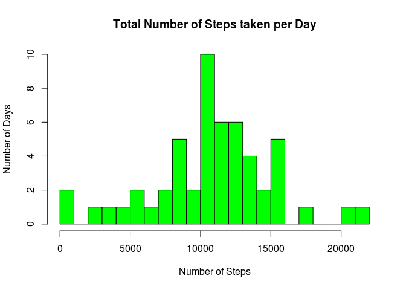
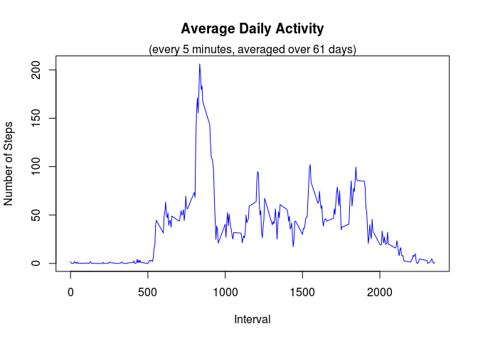
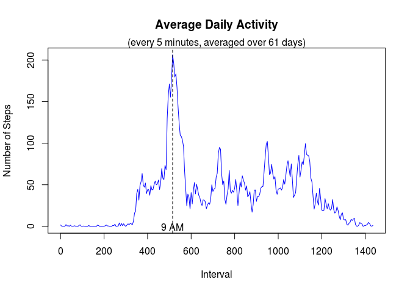
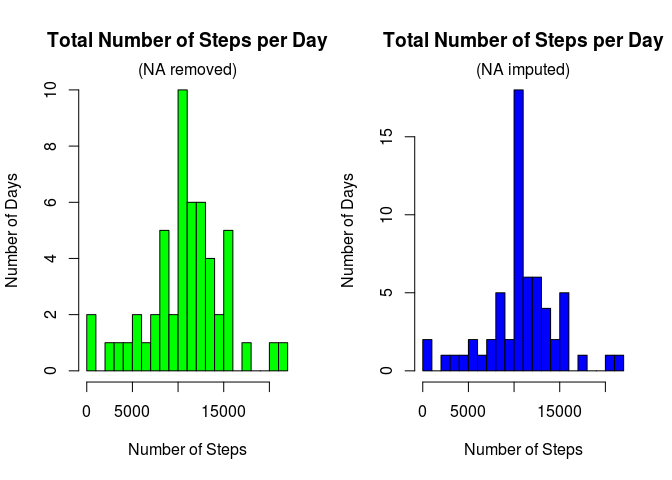
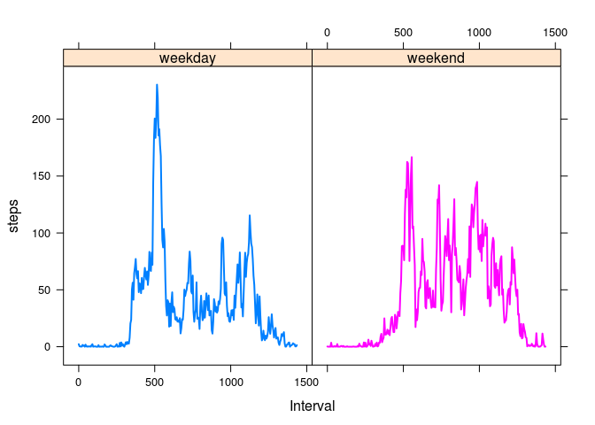

# Reproducible Research: Peer Assessment 1

## Introduction

This is a R markdown for project 1 in Reproducible Research course.  
The assignment requires to load a data set **activity.csv** and produce summaries and plots through various data manipuations. The assignment item topics are copied from the instruction page and underneath each the data processing steps are described. The packages, base plotting system, lattice and data.table are used.

## Data


The variables included in this dataset are:

* **steps**: Number of steps taking in a 5-minute interval (missing
    values are coded as `NA`)

* **date**: The date on which the measurement was taken in YYYY-MM-DD
    format

* **interval**: Identifier for the 5-minute interval in which
    measurement was taken

## Loading and preprocessing the data  


Load data and convert **date** from character to date type, then create data.table.


```r
df<-read.csv("activity.csv")
df$date <- as.Date(df$date)
library(data.table)
dt<-as.data.table(df)
str(dt)
```

```
## Classes 'data.table' and 'data.frame':	17568 obs. of  3 variables:
##  $ steps   : int  NA NA NA NA NA NA NA NA NA NA ...
##  $ date    : Date, format: "2012-10-01" "2012-10-01" ...
##  $ interval: int  0 5 10 15 20 25 30 35 40 45 ...
##  - attr(*, ".internal.selfref")=<externalptr>
```

## What is mean total number of steps taken per day?


```r
total_steps = dt[,list(sum=sum(steps)),by=date]

hist(total_steps$sum,xlab="Number of Steps",ylab="Number of Days",
     breaks=30,main="Total Number of Steps taken per Day",col="green")
```

\

The **mean** and **median** of the total steps per day.


```r
mean_total_steps <- mean(total_steps$sum,na.rm=T)
mean_total_steps
```

```
## [1] 10766.19
```

```r
median_total_steps <- median(total_steps$sum,na.rm=T)
median_total_steps
```

```
## [1] 10765
```


## What is the average daily activity pattern?  


Time series plot of the 5-minute interval and the average number of steps taken, averaged across all days.    


```r
mean_steps_5min <- dt[,.(steps=mean(steps,na.rm=TRUE)),by=interval]

with(mean_steps_5min,
     plot(interval,steps,type="l",xlab="Interval",ylab="Number of Steps", col="blue", main="Average Daily Activity"))
mtext("(every 5 minutes, averaged over 61 days)",3,0)
```

\

The given data's **interval** column has this irregularities; its 5 minute interval jumps 9 steps every 100th, eg., 55 100, 155 200, 255 300, etc., and the result is that although each day has 288 rows (24 hours x 60 minutes / 5 minutes) the interval ends at 2355, not at 1440. This makes x-axis of the histogram incomprehensible.  

We could add a revised interval and use the new interval as x-axis.


```r
mean_steps_5min$myinterval<-seq(0,1435,length.out=288)
```

With the new interval, x-axis becomes 24 hours and the maximum number of steps is observed occuring at interval 515 minutes, i.e, 9 am (515/60). 


```r
with(mean_steps_5min,
     plot(myinterval,steps,type="l",xlab="Interval",ylab="Number of Steps",col="blue", main="Average Daily Activity"))
mtext("(every 5 minutes, averaged over 61 days)",3,0)

max_interval<-mean_steps_5min[steps==max(steps),myinterval]
max_interval
```

```
## [1] 515
```

```r
abline(v=max_interval,lty=2)
text(max_interval,-1, "9 AM")
```

\


## Imputing missing values  


There are 2304 rows of missing **steps**.


```r
total_na<-nrow(dt[is.na(steps),])
total_na
```

```
## [1] 2304
```

The missing rows appear for 8 entire days, not during any other day.  


```r
missing<-dt[is.na(steps),]
table(missing$date)
```

```
## 
## 2012-10-01 2012-10-08 2012-11-01 2012-11-04 2012-11-09 2012-11-10 
##        288        288        288        288        288        288 
## 2012-11-14 2012-11-30 
##        288        288
```

```r
missing_days=names(table(missing$date))
missing_days
```

```
## [1] "2012-10-01" "2012-10-08" "2012-11-01" "2012-11-04" "2012-11-09"
## [6] "2012-11-10" "2012-11-14" "2012-11-30"
```

Therefore, the only reasonable imputation is simply to use the mean steps for the intervals over all the other days.  


```r
# make a copy of the data
dt2<-copy(dt)
setkey(dt2,date)
# change date type of steps from int to numeric, since the means are decimals
dt2$steps<-as.numeric(dt2$steps)

for (d in missing_days){
        dt2[date==as.Date(d),"steps":=mean_steps_5min$steps]
}
# check
table(is.na(dt2))
```

```
## 
## FALSE 
## 52704
```

Examine the total number of steps taken from the new data and compare with the old ones. 
The **means** and the **medians** are virtually identical naturally because the imputation used amounts to adding the same data 8 times.  


```r
total_steps2 = dt2[,list(sum=sum(steps)),by=date]
mean_total_steps2 <- mean(total_steps2$sum)
median_total_steps2 <- median(total_steps2$sum)

comparison=data.frame(mean=c(mean_total_steps,mean_total_steps2),
                      median=c(median_total_steps,median_total_steps2))
row.names(comparison)=c("NA omitted:", "NA imputed:")
comparison
```

```
##                 mean   median
## NA omitted: 10766.19 10765.00
## NA imputed: 10766.19 10766.19
```

The histograms are identical except that y-axis has more data now as there are 8 more days.  


```r
par(mfrow=c(1,2))
hist(total_steps$sum,xlab="Number of Steps",ylab="Number of Days",
     breaks=30,main="Total Number of Steps per Day",col="green")
mtext("(NA removed)",3,0)
hist(total_steps2$sum,xlab="Number of Steps",ylab="Number of Days",
     breaks=30,main="Total Number of Steps per Day",col="blue")
mtext("(NA imputed)",3,0)
```

\


## Are there differences in activity patterns between weekdays and weekends?  


Create a new variable **weekend**.  


```r
weekday=c("Monday","Tuesday","Wednesday","Thursday","Friday")
weekend=c("Saturday","Sunday")
dt2[,weekend:=ifelse(weekdays(date) %in% weekday,"weekday","weekend")]
table(dt2$weekend)
```

```
## 
## weekday weekend 
##   12960    4608
```

Create a time series comparing weekend and weekdays.  


```r
library(lattice)
activityData<-dt2[,.(steps=mean(steps)),by=.(weekend,interval)]
activityData$myinterval<- rep(seq(0,1435,length.out=288),2)
xyplot(steps~myinterval|weekend,type="l",data=activityData,lwd=2,groups=weekend,xlab="Interval")
```

\

The activity pattern that showed maximum steps around 9 AM on weekdays changes to lower number of steps spread throughout the day on weekends.  


